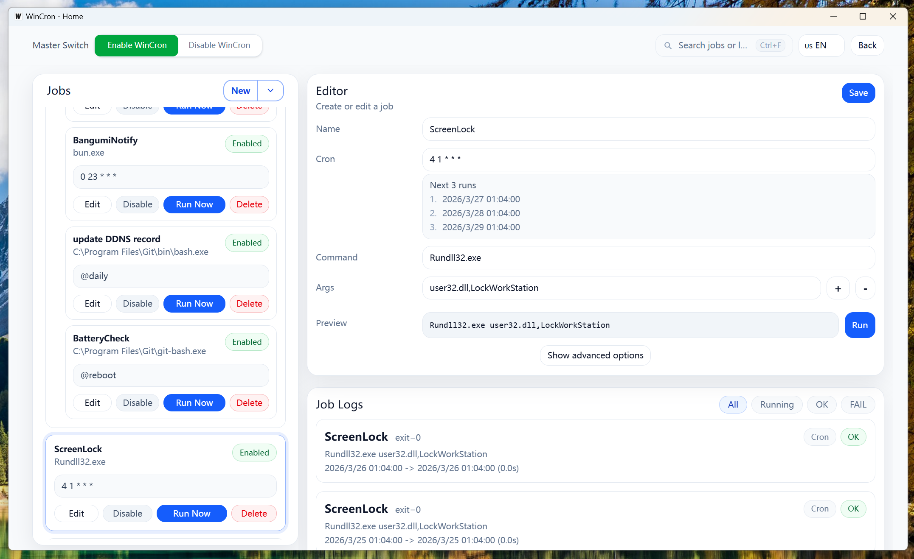

[中文README](./README.zh-CN.md)

# wincron

A lightweight task scheduler for Windows, intended to be more intuitive than the built-in Task Scheduler.

## Features

- Lightweight design: low overhead when idle
- Use cron expressions to schedule and run tasks
- Support command arguments and working directory
- View execution logs
- Failure protection: auto-disable after N consecutive failures
- YAML import/export for jobs (optional settings export)
- Tray-friendly: minimize to tray, optional silent start, and auto-start on boot

## Screenshots

## Installation

### Download Release

- Download zip from the GitHub Releases page.

### Build from Source

1. Install Wails3:

   `go install -v github.com/wailsapp/wails/v3/cmd/wails3@latest`

2. Build (outputs to `bin/` by default):

   `wails3 build`

## Development Environment

- Go: `1.25`
- Wails: `v3.0.0-alpha.60`
- Frontend runtime: `@wailsio/runtime@3.0.0-alpha.78`
- Bun: `v1.0` or above
- Node.js: optional if you prefer npm/pnpm over Bun
