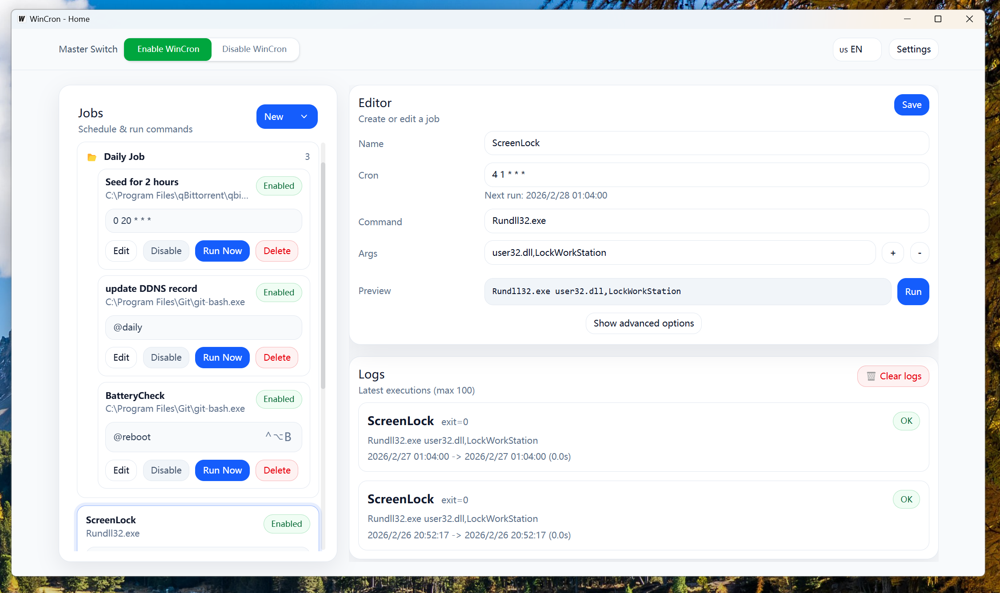
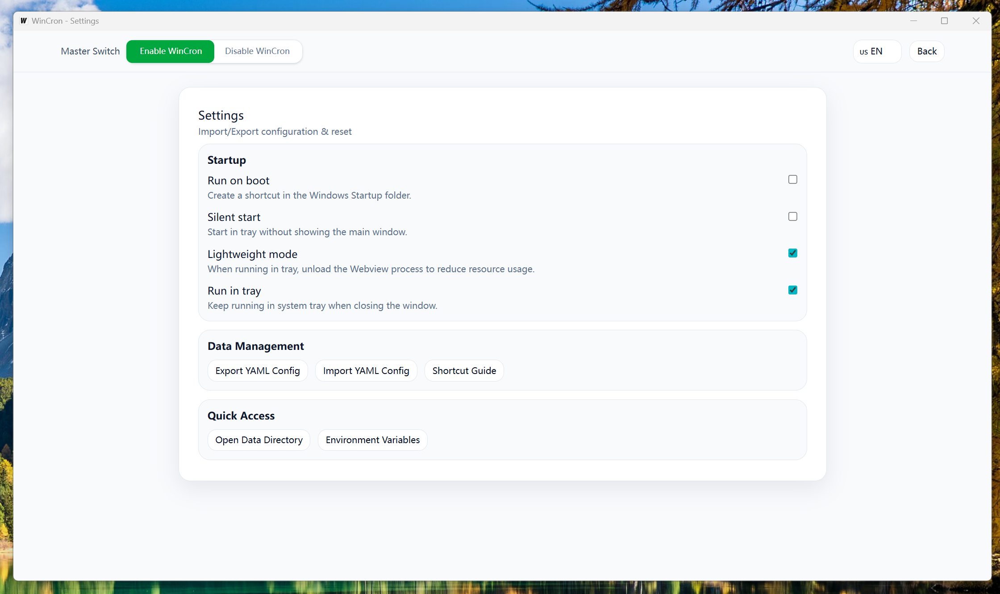

# wincron

一个面向 Windows 的轻量级任务调度器。我希望能比windows自带的任务计划程序用起来更直观。

## 功能/特性

- 轻量设计：单可执行文件；空闲时低开销
- 使用 cron 表达式定时执行任务
- 支持设置命令参数与工作目录
- 记录执行日志
- 高级任务选项：并发策略/多次失败禁用
- 静默启动/开机自启/轻量模式/托盘模式
- 支持设置全局快捷键
- 支持导入/导出
- 支持IPC命令行

## 截图

## 安装方式

> 请确保系统安装了[WebView2](https://developer.microsoft.com/en-us/microsoft-edge/webview2/)

### 下载 Release

- 从 GitHub Releases 页面下载 zip

### 从源码构建

1. 安装 Wails3：

   `go install -v github.com/wailsapp/wails/v3/cmd/wails3@latest`

2. 构建，默认编译到bin/：

   `wails3 build`

## 开发环境

- Go：`1.25`
- Wails：`v3.0.0-alpha.71`
- Bun：`v1.0`或以上
- Node.js：可选（如果你不使用 Bun）
